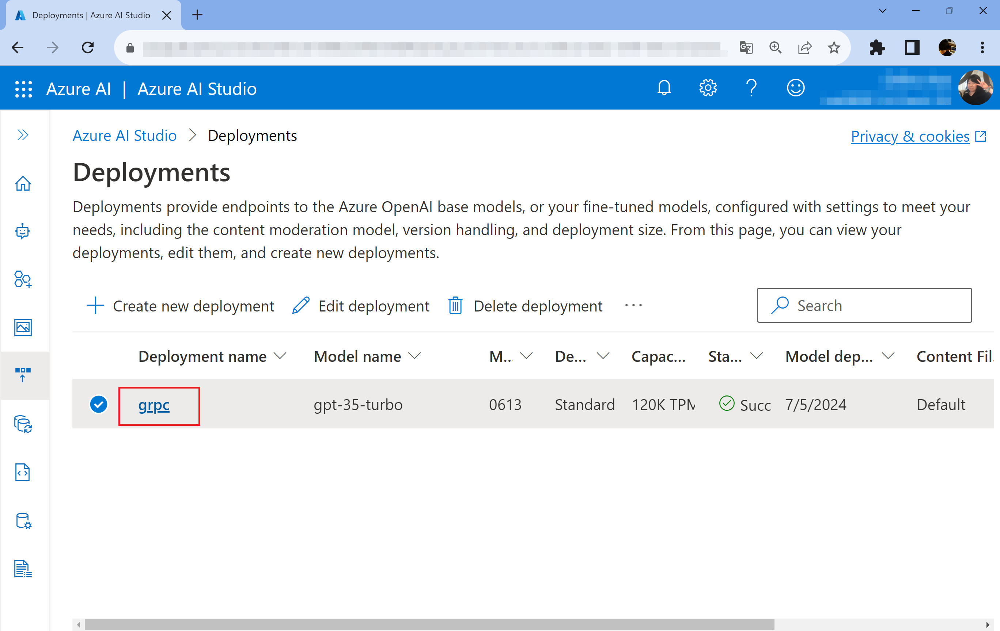
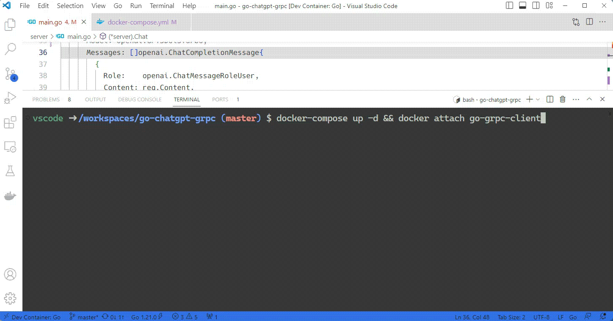

# go-chatgpt-grpc using Azure OpenAI Service

## Overview

This repository contains a simple, yet efficient, gRPC server-client communication setup implemented in Go. It's intended to help developers establish a reliable, quick-response interaction between a server and a client. The server is uses ```gpt-3.5-turbo``` model using [Azure OpenAI Service](https://azure.microsoft.com/en-us/products/ai-services/openai-service) and [Go OpenAI Wrapper](https://github.com/sashabaranov/go-openai) . 

## Motivation
This project originated from the need to seamlessly use  [Azure OpenAI Service](https://azure.microsoft.com/en-us/products/ai-services/openai-service) with custom features on the server-side and effortlessly stream this data to the frontend. It was designed to incorporate aspects like prompt engineering and rule-based systems. I believe this tool, born out of practical necessity, can assist others in similar projects and scenarios. This project is an extension of [mustafamerttunali's repository](https://github.com/mustafamerttunali/go-chatgpt-grpc) and I'm very grateful to him!

## Linux Containers
Before you begin, make sure you have Docker installed on your machine. If you don't, you can download it [here](https://docs.docker.com/get-docker/).

This project includes `.devcontainer`. The Go development environment with containers has already been set up.

Create a local copy of this repository. Add your Azure OpenAI API key and Endpoint to `docker-compose.yml file:

```bash
environment:
      - AOAI_KEY=your-azureopenai-key
      - AOAI_ENDPOINT=your-azureopenai-endpoint
      - AOAI_VERSION=your-azureopenai-rest-version
      - AOAI_DEPLOYNAME=your-azureopenai-deploy-name
```

Please check the [official website](https://learn.microsoft.com/en-us/azure/ai-services/openai/how-to/create-resource?pivots=web-portal) for instructions on how to deploy models and obtain keys for Azure OpenAI Service. `AOAI_VERSION` can be found [here](https://learn.microsoft.com/ja-jp/azure/ai-services/openai/reference#rest-api-versioning) and Please select the latest. but `-preview` may not work correctly.

- 2022-12-01
- 2023-03-15-preview
- 2023-05-15
- 2023-06-01-preview
- 2023-07-01-preview
- 2023-08-01-preview

You can check the value of `AOAI_DEPLOYNAME` in Azure AI Studio. In this case, `grpc` is the deploy name.



Then, run the following command in the root directory of the project:

```bash
docker-compose build
```

This sets compose and builds a local development environment.

After the build is complete (this may take a few minutes), run:

```bash
docker-compose up -d && docker attach go-grpc-client
```



## TODO

- [ ] deploy to [Azure Container Apps](https://azure.microsoft.com/en-us/products/container-apps)
- [ ] deploy to [Azure Kubernete Service](https://azure.microsoft.com/en-us/products/kubernetes-service)

## Contributing

Any contributions are welcome. If you have any questions, Contact me at issues.
